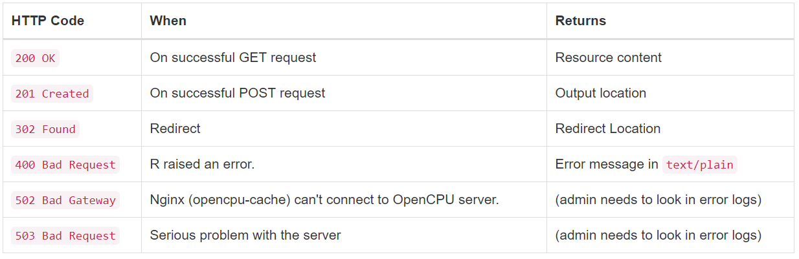
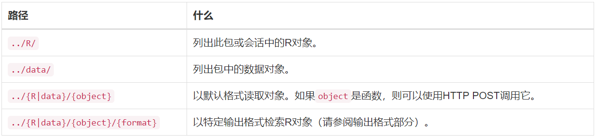
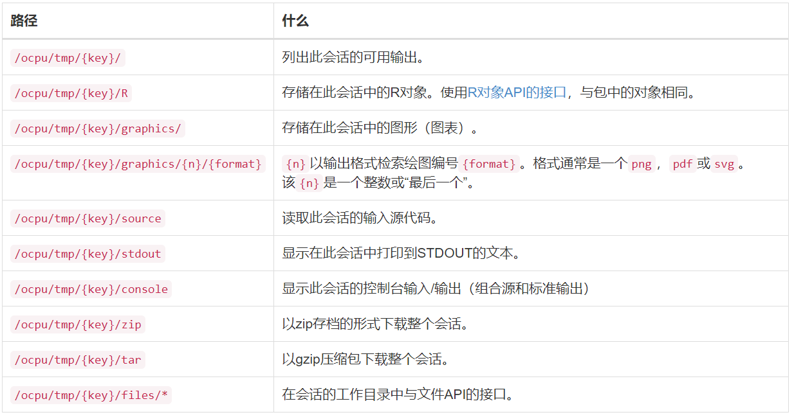
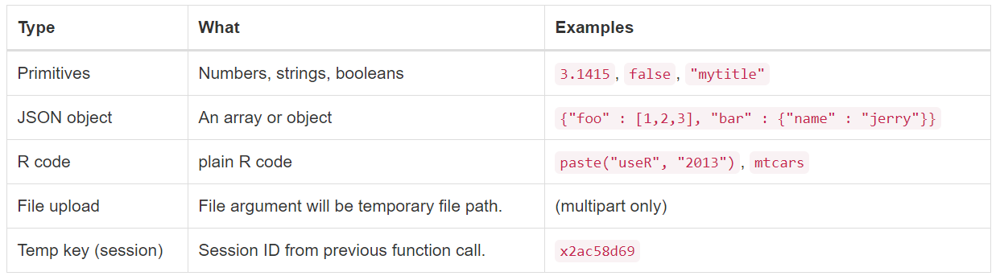
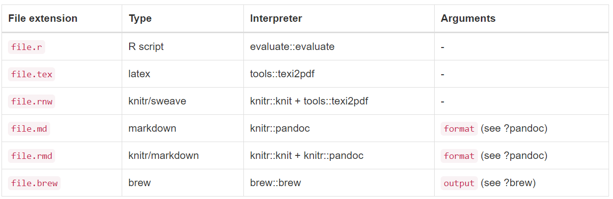
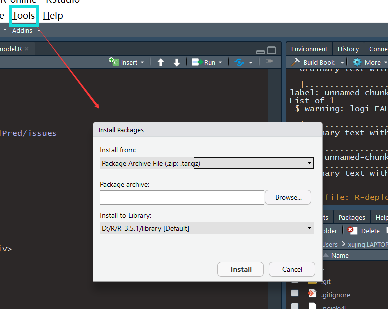
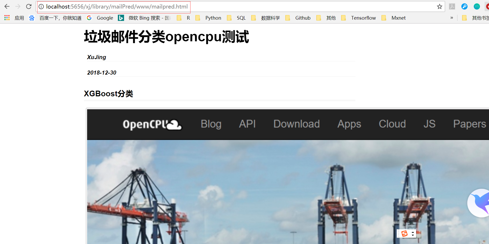

# opencpu


## 安装

关于opencpu-server的安装和本地单用户服务器的安装可以参考 <https://www.opencpu.org/download.html>, opencpu官方推荐在Ubuntu 18.04 / 16.04中使用opencpu-server, 关于Fedora,Debian,CentOS等系统的安装可以参考<https://github.com/opencpu>

### Ubuntu 18.04/16.04 安装

```r
# Requires Ubuntu 18.04 (Bionic) or 16.04 (Xenial)
sudo add-apt-repository -y ppa:opencpu/opencpu-2.1
sudo apt-get update 
sudo apt-get upgrade

# Installs OpenCPU server
sudo apt-get install -y opencpu-server
# Done! Open http://yourhost/ocpu in your browser

# rstudio server的安装(不是必须的)
sudo apt-get install -y rstudio-server 

# 安装完之后，需要检查自己R中的curl包及stringi等包的版本，
# 同时如果需要R markdown还需要安装pandoc

sudo apt-get install pandoc

```

### 本地单用户服务器

```r
# Install OpenCPU
install.packages("opencpu")

# Run Apps directly from Github
library(opencpu)
ocpu_start_app("rwebapps/nabel")
ocpu_start_app("rwebapps/markdownapp")
ocpu_start_app("rwebapps/stockapp")

# Run Apps directly from library
library(opencpu)
ocpu_start_server()

# Install / remove apps
remove_apps("rwebapps/stockapp")
```


## API文档

<style type="text/css"> 
/*	.panel-primary {
	    border-color: #428bca;
	}*/

	.panel {
	    margin-bottom: 20px;
	    background-color: #fff;
	    border: 1px solid transparent;
	    border-radius: 4px;
	    -webkit-box-shadow: 0 1px 1px rgba(0,0,0,0.05);
	    box-shadow: 0 1px 1px rgba(0,0,0,0.05);
	    border-color: #428bca;
	}

	.panel-heading {
	    padding: 5px 15px;
	    border-bottom: 1px solid #357ae8;
	    border-top-right-radius: 3px;
	    border-top-left-radius: 3px;
	    background-color:#357ae8
	}

	.panel-body {
	    padding: 15px;
	}
</style>


### OpenCPU中的HTTP

------

<div class="panel">
<div class="panel-heading">
<h4> <font style="vertical-align: inherit;"><font style="vertical-align: inherit;">OpenCPU根路径</font></font></h4>
</div>
<div class="panel-body">

<p>API的root是动态的。默认为`/ocpu/`，可以更改此设置。通过R启动的本地服务，可以通过`ocpu_start_server(port = 5656, root = "/ocpu", workers = 2,preload = NULL, on_startup = NULL, no_cache = FALSE)`中的rootc参数修改，opencpu-server可以通过修改`/usr/lib/opencpu/rapache`中的文件进行修改。在下面的示例中，我们假设默认值/ocpu/。</p>

</div>
</div>

------

<div class="panel">
<div class="panel-heading">
<h4> <font style="vertical-align: inherit;"><font style="vertical-align: inherit;">Debug</font></font></h4>
</div>
<div class="panel-body">

+ `http://172.16.100.202/ocpu/info` opencpu的一些详细的信息
+ 该`http://172.16.100.202/ocpu/test` URL为您提供了一个方便的测试网页来执行服务器请求

</div>
</div>


------

<div class="panel">
<div class="panel-heading">
<h4> <font style="vertical-align: inherit;"><font style="vertical-align: inherit;">Http的方法</font></font></h4>
</div>
<div class="panel-body">

<p>OpenCPU目前只使用HTTP方法GET和POST。GET用于检索资源，POST用于[RPC](https://blog.csdn.net/b1303110335/article/details/79557292)。POST请求仅对脚本或功能URL有效。</p>

<div align=center></div>

```r
# Get 举栗
curl http://172.16.100.202/ocpu/library/MASS/data/Boston/json
curl http://172.16.100.202/ocpu/library/MASS/NEWS
curl http://172.16.100.202/ocpu/library/MASS/scripts/

#Post 举栗 -X POST or -d "arg=value"
curl http://172.16.100.202/ocpu/library/MASS/scripts/ch01.R -X POST
curl http://172.16.100.202/ocpu/library/stats/R/rnorm -d "n=10&mean=5"


```
		

</div>
</div>


------

<div class="panel">
<div class="panel-heading">
<h4> <font style="vertical-align: inherit;"><font style="vertical-align: inherit;">Http状态码</font></font></h4>
</div>
<div class="panel-body">

<p>这些是OpenCPU返回的常见状态代码，客户端应该能够解释这些状态代码</p>

<div align=center></div>

</div>
</div>


### API 端点(EndPoints)

------

<div class="panel">
<div class="panel-heading">
<h4> <font style="vertical-align: inherit;"><font style="vertical-align: inherit;">The API Libraries</font></font></h4>
</div>
<div class="panel-body">

<div align=center></div>

```r
#read packages 举栗
curl http://172.16.100.202/ocpu/library/
curl http://172.16.100.202/ocpu/apps/rwebapps/
curl http://172.16.100.202/ocpu/user/jeroen/library/

#read session 举栗
curl http://172.16.100.202/ocpu/tmp/x2c5ab8d4d6
```

</div>
</div>

------

<div class="panel">
<div class="panel-heading">
<h4> <font style="vertical-align: inherit;"><font style="vertical-align: inherit;">The R package API</font></font></h4>
</div>
<div class="panel-body">

<p>`/{package}/`库都支持以下端点：</p>

<div align=center></div>

```r
#package info
curl http://172.16.100.202/ocpu/library/MASS/

#package objects (mostly functions)
curl http://172.16.100.202/ocpu/library/MASS/R/
curl http://172.16.100.202/ocpu/library/MASS/R/rlm/print

#package data objects
curl http://172.16.100.202/ocpu/library/MASS/data/
curl http://172.16.100.202/ocpu/library/MASS/data/housing/json

#read manuals pages
curl http://172.16.100.202/ocpu/library/MASS/man/
curl http://172.16.100.202/ocpu/library/MASS/man/rlm/text
curl http://172.16.100.202/ocpu/library/MASS/man/rlm/html
curl http://172.16.100.202/ocpu/library/MASS/man/rlm/pdf

#read files included with this package
curl http://172.16.100.202/ocpu/library/MASS/scripts/
curl http://172.16.100.202/ocpu/library/MASS/scripts/ch01.R
curl http://172.16.100.202/ocpu/library/MASS/NEWS

#call a function (example from 'rlm' help page)
curl http://172.16.100.202/ocpu/library/MASS/R/rlm -d "formula=stack.loss ~ .&data=stackloss&psi=psi.bisquare"

#run R script
curl http://172.16.100.202/ocpu/library/MASS/scripts/ch01.R -X POST

#read output (replace key with value returned from previous request)
curl http://172.16.100.202/ocpu/tmp/x0648ec526b/R/.val/print
```

</div>
</div>


------

<div class="panel">
<div class="panel-heading">
<h4> <font style="vertical-align: inherit;"><font style="vertical-align: inherit;">The R object API</font></font></h4>
</div>
<div class="panel-body">

<p>`/R` API 用来读取R对象或者调用R的方法.</p>

<div align=center></div>

```r
#list objects and datasets from MASS
curl http://172.16.100.202/ocpu/library/MASS/R/
curl http://172.16.100.202/ocpu/library/MASS/data/

#retrieve objects
curl http://172.16.100.202/ocpu/library/MASS/R/truehist/print
curl http://172.16.100.202/ocpu/library/MASS/data/bacteria/print
curl http://172.16.100.202/ocpu/library/MASS/data/bacteria/json
curl http://172.16.100.202/ocpu/library/MASS/data/bacteria/csv
curl http://172.16.100.202/ocpu/library/MASS/data/bacteria/rda

#call a function
curl http://172.16.100.202/ocpu/library/MASS/R/truehist -d "data=[1,3,7,4,2,4,2,6,23,13,5,2]"
```

</div>
</div>


------

<div class="panel">
<div class="panel-heading">
<h4> <font style="vertical-align: inherit;"><font style="vertical-align: inherit;">The R session API</font></font></h4>
</div>
<div class="panel-body">

<p>会话(session)是一个容器，用于保存从远程函数/脚本调用（RPC）创建的资源。</p>

<div align=center></div>

```r
#A POST will create a temporary session
#Use the returned key for the subsequent calls below
curl http://172.16.100.202/ocpu/library/MASS/scripts/ch01.R -X POST

#Look at console input/output
curl http://172.16.100.202/ocpu/tmp/x05b85461/console/text

#We read session R objects
curl http://172.16.100.202/ocpu/tmp/x05b85461/
curl http://172.16.100.202/ocpu/tmp/x05b85461/R/
curl http://172.16.100.202/ocpu/tmp/x05b85461/R/dd/csv
curl http://172.16.100.202/ocpu/tmp/x05b85461/R/t.stat/print

#Or even call a function
curl http://172.16.100.202/ocpu/tmp/x05b85461/R/t.stat -d "x=[1,0,0,1,1,1,0,1,1,0]"

#Download file from the working dir
curl http://172.16.100.202/ocpu/tmp/x05b85461/files/ch01.pdf

#Check sessionInfo
curl http://172.16.100.202/ocpu/tmp/x05b85461/info/print
```

</div>
</div>


### 输入，输出：数据和格式

------

<div class="panel">
<div class="panel-heading">
<h4> <font style="vertical-align: inherit;"><font style="vertical-align: inherit;">R对象的输出格式</font></font></h4>
</div>
<div class="panel-body">

<p>可以以各种输出格式检索任何R对象（包括记录的图形）</p>

<div align=center></div>

```r
#read R objects from packages.
curl http://172.16.100.202/ocpu/library/datasets/R/mtcars/json?digits=0
curl http://172.16.100.202/ocpu/library/datasets/R/mtcars/csv
curl http://172.16.100.202/ocpu/library/datasets/R/mtcars/tab?sep="|"
curl http://172.16.100.202/ocpu/library/MASS/R/loglm/print
```

```r
#create a simple plot
curl http://172.16.100.202/ocpu/library/graphics/R/plot -d "x=cars"

#replace session id with returned one
curl http://172.16.100.202/ocpu/tmp/x0468b7ab/graphics/last/png
curl http://172.16.100.202/ocpu/tmp/x0468b7ab/graphics/1/png?width=1000
curl http://172.16.100.202/ocpu/tmp/x0468b7ab/graphics/last/svg
curl http://172.16.100.202/ocpu/tmp/x0468b7ab/graphics/last/pdf?width=8

```

</div>
</div>


------

<div class="panel">
<div class="panel-heading">
<h4> <font style="vertical-align: inherit;"><font style="vertical-align: inherit;">R函数调用的参数格式（仅限HTTP POST）</font></font></h4>
</div>
<div class="panel-body">

<p>调用函数时，我们需要传递参数。OpenCPU接受以下类型的参数</p>

<div align=center></div>

执行函数功能时, Post的数据 (请求体) 可以使下面面的任意形式：` multipart/form-data`, `application/x-www-form-urlencoded`, `application/json` 或者 `application/x-protobuf`. 并非每个content-type都支持任何参数格式:

<div align=center></div>

```r
#call some functions
curl http://172.16.100.202/ocpu/library/stats/R/rnorm -d "n=10&mean=5"
curl http://172.16.100.202/ocpu/library/graphics/R/hist -d "x=[2,3,2,3,4,3,3]&breaks=10"
curl http://172.16.100.202/ocpu/library/graphics/R/plot -d "x=cars&main='test'"
curl http://172.16.100.202/ocpu/library/base/R/identity -d "x=coef(lm(speed~dist, data=cars))"
```

```r
#upload local file mydata.csv
curl http://172.16.100.202/ocpu/library/utils/R/read.csv -F "file=@mydata.csv"

#replace session id with returned one above
curl http://172.16.100.202/ocpu/tmp/x067b4172/R/.val/print
curl http://172.16.100.202/ocpu/library/base/R/summary -d "object=x067b4172"
```

```r
#post arguments in json
curl http://cloud.opencpu.org/ocpu/library/stats/R/rnorm \
-H "Content-Type: application/json" -d '{"n":10, "mean": 10, "sd":10}'
```

</div>
</div>


------

<div class="panel">
<div class="panel-heading">
<h4> <font style="vertical-align: inherit;"><font style="vertical-align: inherit;">运行脚本和可重现的文档</font></font></h4>
</div>
<div class="panel-body">

<p>我们可以通过对文件执行HTTP POST来运行脚本。该脚本根据其（不区分大小写）文件扩展名进行解释。任何HTTP POST参数都会传递给解释函数。支持以下类型：</p>

<div align=center></div>


```r
#run scripts which exist in packages
curl http://172.16.100.202/ocpu/library/MASS/scripts/ch01.R -X POST
curl http://172.16.100.202/ocpu/library/brew/featurefull.brew -X POST
curl http://172.16.100.202/ocpu/library/brew/brew-test-2.brew -d "output=output.html"
curl http://172.16.100.202/ocpu/library/knitr/examples/knitr-minimal.Rmd -X POST
curl http://172.16.100.202/ocpu/library/knitr/examples/knitr-minimal.Rmd -d "format=docx"
curl http://172.16.100.202/ocpu/library/knitr/examples/knitr-minimal.Rmd -d "format=html"
curl http://172.16.100.202/ocpu/library/knitr/examples/knitr-minimal.Rnw
```

</div>
</div>


------

<div class="panel">
<div class="panel-heading">
<h4> <font style="vertical-align: inherit;"><font style="vertical-align: inherit;">JSON I / O RPC（又名数据处理单元）</font></font></h4>
</div>
<div class="panel-body">

<p>对于客户端只对JSON格式的函数调用的输出数据感兴趣的常见特殊情况，可以使用后置修复HTTP POST请求URL /json。在这种情况下，成功调用将返回状态200（而不是201），并且响应主体直接包含JSON中返回的对象; 无需额外的GET请求。</p>


```r
curl http://cloud.opencpu.org/ocpu/library/stats/R/rnorm/json -d n=2
[
-1.2804,
-0.75013
]

```

<p>我们可以将它与application/jsonR函数上的完整JSON RPC 的请求内容类型相结合</p>

```r
curl http://cloud.opencpu.org/ocpu/library/stats/R/rnorm/json \
-H "Content-Type: application/json" -d '{"n":3, "mean": 10, "sd":10}'
[
4.9829,
6.3104,
11.411
]
```

<p>上面的请求调用以下R函数调用:</p>

```r
library(jsonlite)
args <- fromJSON('{"n":3, "mean": 10, "sd":10}')
output <- do.call(stats::rnorm, args)
toJSON(output)

```

<p>在这种情况下，相当于：</p>

```r
rnorm(n=3, mean=10, sd=10)
```

</div>
</div>


### 其他功能

------

<div class="panel">
<div class="panel-heading">
<h4> <font style="vertical-align: inherit;"><font style="vertical-align: inherit;">OpenCPU应用程序</font></font></h4>
</div>
<div class="panel-body">

<p>OpenCPU应用程序是包含在R包中的静态网页（html，css，js）。它们通过OpenCPU API连接此包中的R函数。按照惯例，这些应用程序放在`/inst/www/`R源包的目录中。有关[应用页面](https://www.opencpu.org/apps.html)的更多信息，请参阅。</p>

```r
rnorm(n=3, mean=10, sd=10)
```

</div>
</div>


------

<div class="panel">
<div class="panel-heading">
<h4> <font style="vertical-align: inherit;"><font style="vertical-align: inherit;">Github CI Hook</font></font></h4>
</div>
<div class="panel-body">

<p>OpenCPU云服务器包括对持续集成（CI）的支持。因此，每次将提交推送到主分支时，可以将Github存储库配置为在OpenCPU服务器上自动安装程序包。要利用此功能，需要：</p>

1. R源包位于存储库的根目录中。[（例）](https://github.com/rwebapps/appdemo)
2. Github用户帐户有一个公共电子邮件地址

要设置CI，`/ocpu/webhook`请在Github存储库中将服务器的URL 添加为“WebHook”。例如，要使用公共演示服务器，请添加带有以下URL的webhook（您可以保持Content-type和Secret字段不变）

```r
https://cloud.opencpu.org/ocpu/webhook
```

要触发build，请将提交推送到主分支。build将显示在您的github webhook页面中的Recent Deliveries下，如果安装成功，您应该收到一封电子邮件（在您的垃圾邮件文件夹中）。如果是，则该程序包将直接可用于`/ocpu/apps/{username}/{package}/`服务器上的远程使用。

<div align=center></div>

如果您使用的是公共服务器，则该程序包也可以通过`https://{yourname}.ocpu.io/{package}/`。如果您正在运行自己的OpenCPU云服务器，则必须配置SMTP服务器才能使电子邮件通知正常工作。

</div>
</div>


## XGBoost模型部署实例

本节将基于垃圾邮件的分类任务，训练一个XGBoost模型，基于训练的XGBoost模型构建一个R包，该R包的功能用于预测一封邮件是垃圾邮件的概率，并构建一个前端的页面，测试前端页面在opencpu中是可用的。其步骤如下:

### 训练模型

```r
library(xgboost)
library(ElemStatLearn)
# 用于构建R包使用
data <- save(spam,file='mail_data.rda')

x = as.matrix(spam[, -ncol(spam)])
y = as.numeric(spam$spam) - 1
xgbmodel = xgboost(data = x, label = y, nrounds = 5, objective = 'binary:logistic')
# 这里模型保存的路径可以自己设置
# 保存的训练模型用于构建R包
save(xgbmodel, file="xgb.rda")

xgb_model <- load("xgb.rda")
xgbmodel

data_spam <- as.matrix(spam[1, -ncol(spam)])
pred <- predict(xgbmodel,data_spam)
# pred <- xgboost:::predict.xgb.Booster(object = xgbmodel, newdata = data_spam)

```

### 构建R包

关于R包的构建，本教程不做详细的介绍，如果个人感兴趣可以参考R官网中的教程或Hadley Wickham的[《R packages》](http://r-pkgs.had.co.nz/)

<div align=center></div>

```r
#' @title Mail predict test for opencpu
#' @description Mail predict test for opencpu.
#' @name mailPred
#' @aliases mailPred
#' @author Xu Jing
#' @usage mailPreds(id)
#' @param id The row of mial data
#'
#' @import xgboost
#' @import jsonlite
#' @import stats
#' @import utils
#'
#' @export mailPreds
mailPreds <- function(id = '1') {

  message("XGBoost model test on opencpu!")

  spam <- NULL
  xgbmodel <- NULL

  spam_path <- system.file("extdata", "mail_data.rda", package = "mailPred")
  xgbmodel_path <- system.file("extdata", "xgb.rda", package = "mailPred")

  data_spam <- load(spam_path)
  model_xgb <- load(xgbmodel_path)

  x = as.matrix(spam[as.integer(id), -ncol(spam)])
  # y = as.numeric(spam[as.integer(id), ncol(spam)]) - 1
  pred <- predict(xgbmodel,x)
  # print(spam)

  return(list(class = pred,id=id))
}
```

```r
# DESCRIPTION

Package: mailPred
Type: Package
Title: XGBoost Predict Mail
Version: 0.1.0
Author: XuJing
Maintainer: XuJing <274762204@qq.com>
Description: Mail predict test for opencpu.
License: GPL (>= 2)
Encoding: UTF-8
LazyData: false
Date: 2018-12-30
URL: https://github.com/DataXujing/mailPred
BugReports: https://github.com/DataXujing/mailPred/issues
RoxygenNote: 6.1.1
Depends: R (>= 3.4.0)
Imports: xgboost,jsonlite,stats,utils
Suggests: rmarkdown, knitr
VignetteBuilder: knitr

```


### 编译R包并安装

<div align=center></div>

+ Rstudio中离线安装

<div align=center></div>

+ Ubuntu中离线安装

```r
R CMD INSTALL mailPred_0.1.0.tar.gz
```

### opencpu的一些配置

修改opencup服务参数，文件位于 `/etc/opencpu/server.conf`，增加预加载的包

```r
"preload": ["jsonlite","xgboost","glmnet","mailPred","ocputest"]
```

### 本地opencpu服务测试

```r
library(opencpu)
ocpu_start_server(root='xj')
```

```r
http://localhost:5656/xj/test/
http://localhost:5656/xj/library/mailPred/info
http://localhost:5656/xj/library/mailPred/www/mailpred.html

```

<div align=center></div>
<div align=center></div>


### Ubuntu 16.04 opencpu-server部署测试


<div align=center></div>
<div align=center></div>


### Github部署测试

详细的参考Github CI Hook部分及<https://github.com/DataXujing/mailPred>


### 官方例子

官方提供了更多的例子，详细的可以参考<https://www.opencpu.org/apps.html>

