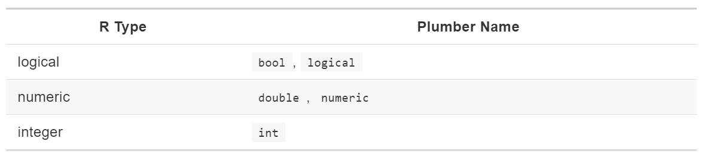
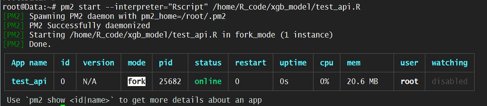
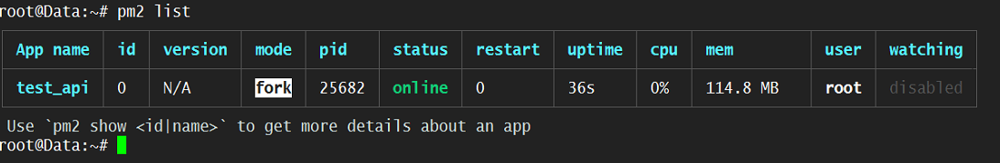
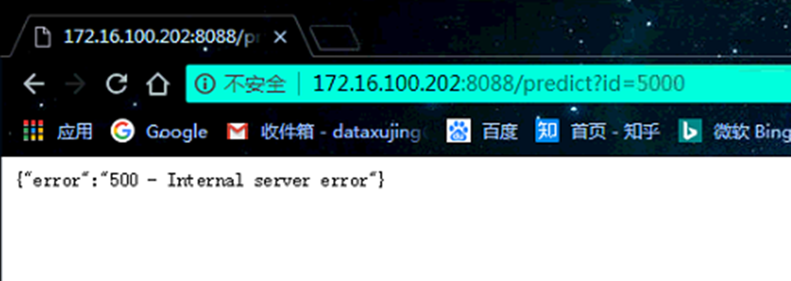

# plumber

<div align=center></div>

HTTP API已成为软件通信的主要语言。通过创建HTTP API，您将使您的R代码能够被其他服务利用 - 无论它们是在您的组织内部还是托管在世界的另一端。以下是在您将R代码包装在Plumber API中时向您打开的门的一些想法：

+ 在您的组织中使用其他语言编写的软件可以运行您的R代码。您公司的Java应用程序现在可以引入您按需生成的自定义ggplot2图表，或者Python客户端可以查询R中定义的预测模型。

+ 您可以代表您使用某些[第三方接收电子邮件](https://www.mailgun.com/)，然后在新邮件到达时通知您的Plumber服务。
您可以在Slack上注册一个“ [Slash Command](https://api.slack.com/slash-commands) ”，使您能够执行R功能以响应Slack中输入的命令。

+ 您可以编写从访问者的Web浏览器查询Plumber 
API的JavaScript代码。更进一步，您可以将Plumber专门用作交互式Web应用程序的后端。

Plumber托管在CRAN上，因此您可以通过运行以下命令下载并安装最新的稳定版本及其所有依赖项：

```r
install.paclages("plumber")
```

或者，如果您想运行最新的不稳定开发版本plumber，可以使用该软件包从其GitHub存储库安装它devtools。

```r
install.packages("devtools")
devtools::install_github("trestletech/plumber")
```

## 快速开始

Plumber允许您通过仅使用特殊注释装饰现有R代码来创建API(#*或#’)。下面的示例显示了一个名为plumber.R（Plumber API的常规名称）的文件，该文件定义了API。

```r

# plumber.R

#' Echo the parameter that was sent in
#' @param msg The message to echo back.
#' @get /echo
function(msg=""){
  list(msg = paste0("The message is: '", msg, "'"))
}


#' Plot out data from the iris dataset
#' @param spec If provided, filter the data to only this species (e.g. 'setosa')
#' @get /plot
#' @png
function(spec){
  myData <- iris
  title <- "All Species"

  # Filter if the species was specified
  if (!missing(spec)){
    title <- paste0("Only the '", spec, "' Species")
    myData <- subset(iris, Species == spec)
  }

  plot(myData$Sepal.Length, myData$Petal.Length,
       main=title, xlab="Sepal Length", ylab="Petal Length")
}
```
此文件定义了两个Plumber“端点”。一个托管在路径上/echo，只是回显传入的消息; 另一个托管在路径上/plot并返回一个显示简单R图的图像。

你可以使用plumber::plumb函数来此R档转换成管道工API：

```r
pr <- plumber::plumb("plumber.R")
```

该pr对象现在封装了plumber.R文件中表示的所有逻辑。下一步是使用以下run方法使API生效：

```r
pr$run()
```

不妨运行试一下！！！


在前面的示例中，您看到了一个呈现为JSON的端点和一个生成图像的端点。除非另有说明，否则Plumber将尝试呈现您的端点函数返回的任何内容作为JSON。但是，您可以指定备用“序列化程序”，指示Plumber将输出呈现为其他格式，如HTML（`@html`），PNG（`@png`）或JPEG（`@jpeg`）

```r
#' @get /hello
#' @html
function(){
  "<html><h1>hello world</h1></html>"
}
```
访问时，此端点将生成类似以下内容的内容。它还设置了适当的Content-Type标题，以便访问此页面的浏览器知道将结果呈现为HTML。

```r
<html><h1>hello world</h1></html>
```

我们将在API的输出中详细讲解。


## 路由和输入

传入的HTTP请求必须“路由”到一个或多个R函数。Plumber有两个不同的函数系列：端点和过滤器。

<div align=center></div>

通常，当请求到达Plumber路由器时，Plumber首先将该请求通过其过滤器。一旦所有过滤器处理了请求，路由器将查找可满足传入请求的端点。如果找到一个，它将调用端点并使用端点返回的值响应传入的请求。如果没有端点与请求匹配，则将404 Not Found返回错误（其行为可由set404Handler方法控制）详见自定义路由。


### 端点

此批注指定此函数负责生成对任何GET请求的响应/hello。从函数返回的值将用作对请求的响应（在通过序列化程序运行以将响应转换为JSON之后）。在这种情况下，GET响应/hello将返回["hello world"]带有的内容JSON Content-Type。

生成端点的注释包括：

+ `@get`

+ `@post`

+ `@put`

+ `@delete`

+ `@head`

请注意，单个端点可以支持多个动词。下面的函数将被用来处理任何传入的GET，POST或PUT请求/cars

```r
#' @get /cars
#' @post /cars
#' @put /cars
function(){
  ...
}
```

### 过滤器

过滤器可用于定义用于处理传入请求的“管道”。这允许API作者将复杂的逻辑分解为一系列独立的，可理解的步骤。与端点不同，请求可以在生成响应之前通过多个Plumber过滤器。

通常，Plumber路由器会在尝试查找满足请求的端点之前，通过所有已定义的过滤器传递请求。

过滤器可以在处理请求时执行以下三种操作之一：

1. 可能在改变请求之后将控制转发到下一个处理程序。

2. 返回响应本身而不是转发给后续处理程序

3. 抛出一个错误


#### 转发给另一个处理程序

过滤器最常见的行为是在改变传入请求或调用某些外部副作用后将请求传递给下一个处理程序。一个常见的用例是使用过滤器作为请求记录器：

```r
#* Log some information about the incoming request
#* @filter logger
function(req){
  cat(as.character(Sys.time()), "-", 
    req$REQUEST_METHOD, req$PATH_INFO, "-", 
    req$HTTP_USER_AGENT, "@", req$REMOTE_ADDR, "\n")
  plumber::forward()
}

```

此过滤器是直接的：它调用外部操作（日志记录），然后调用forward()将控制权传递给管道中的下一个处理程序（另一个过滤器或端点）

类似的过滤器可能会改变它给出的请求或响应对象上的某些状态

```r
#* @filter setuser
function(req){
  un <- req$cookies$user
  # Make req$username available to endpoints
  req$username <- un

  plumber::forward()
}
```

#### 返回响应

过滤器也可以返回响应。您可能希望检查请求是否满足某些约束（如身份验证），并且 - 在某些情况下 - 返回响应而不调用任何其他处理程序。例如，可以使用过滤器来检查用户是否已经过身份验证。

```r
#* @filter checkAuth
function(req, res){
  if (is.null(req$username)){
    res$status <- 401 # Unauthorized
    return(list(error="Authentication required"))
  } else {
    plumber::forward()
  }
}
```

Plumber API中出现错误的常见原因是忘记forward()在过滤器中调用。在这样的过滤器中，最后一行的结果将作为对传入请求的响应以静默方式返回。这可能会导致您的API表现出非常奇怪的行为，具体取决于返回的内容。当您使用过滤器时，请务必仔细审核所有代码路径，以确保您正在调用forward()，导致错误或故意返回值。


#### 抛出错误

最后，过滤器可能会抛出错误。如果在定义过滤器的代码中出错或者过滤器故意调用stop()以触发错误，则会发生这种情况。在这种情况下，任何后续处理程序都不会处理请求，并且会立即将其发送到路由器的错误处理程序。有关如何自定义此错误处理程序的详细信息，请参阅路由器自定义。


### 动态路由

除了具有类似硬编码的路由之外/hello，Plumber端点还可以具有动态路由。动态路由允许端点定义一组更灵活的路径，以便它们匹配。

```r
users <- data.frame(
  uid=c(12,13),
  username=c("kim", "john")
)

#' Lookup a user
#' @get /users/<id>
function(id){
  subset(users, uid==id)
}
```

此API使用动态路径/users/<id>来匹配任何形式的请求，/users/后跟一些路径元素，如数字或字母。在这种情况下，如果找到具有相关ID的用户，则返回有关用户的信息，否则返回空对象。

此API使用动态路径/users/<id>来匹配任何形式的请求，/users/后跟一些路径元素，如数字或字母。在这种情况下，如果找到具有相关ID的用户，则返回有关用户的信息，否则返回空对象。

您可以根据需要命名这些动态路径元素，但请注意，动态路径中使用的名称必须与函数的参数名称匹配（在本例中为两者id）。

您甚至可以执行更复杂的动态路由，例如：

```r
#' @get /user/<from>/connect/<to>
function(from, to){
  # Do something with the `from` and `to` variables...
}
```

除非另有说明，否则从查询字符串或动态路径传递到管道工端点的所有参数都将是字符串。例如，请考虑以下API。

```r
#' @get /type/<id>
function(id){
  list(
    id = id,
    type = typeof(id)
  )
}
```

访问http：// localhost：8000 / types / 14将返回：

```r
{
  "id": ["14"],
  "type": ["character"]
}
```

如果您只打算支持动态路由中特定参数的特定数据类型，则可以在路径本身中指定所需的类型。

```r
#* @get /user/<id:int>
function(id){
  next <- id + 1
  # ...
}

#* @post /user/activated/<active:bool>
function(active){
  if (!active){
    # ...
  }
}
```

下面详细介绍了可以在动态类型中使用的类型名称的映射以及它们如何映射到R数据类型。

<div align=center></div>


#### 静态文件处理


plumber包括一个静态文件服务器，可用于托管静态资源（如JavaScript，CSS或HTML文件）的目录。这些服务器配置相当简单，并且可以集成到plumber应用程序中。

```r
#* @assets ./files/static
list()
```

此示例将在服务器./files/static的默认/public路径中公开本地目录。因此，如果您有一个文件./files/static/branding.html，它将在您的plumber服务器上可用/public/branding.html。

您可以选择提供其他参数来配置用于服务器的公共路径。例如

```r
#* @assets ./files/static /static
list()
```

请求的目录不在/public，但在/static

在上面的示例中，服务器的“实现”只是一个空的list()。还可以指定function()与其他plumber注释类似的操作。此时，实现不会改变静态服务器的行为。最终，此列表或函数可以通过更改缓存控制设置等内容来提供配置服务器的机会。

#### 输入处理

根据传入HTTP请求的路径和方法路由请求，但请求可以包含比此更多的信息。它们可能包含其他HTTP标头，查询字符串或请求正文。所有这些字段都可以被视为您的Plumber API的“输入”。

这个可以详细的参考plumber的官方文档，在此不再赘述。


## Rendering Output

### 序列化器

默认情况下，Plumber通过jsonliteR包将对象序列化为JSON 。但是，包中内置了各种其他序列化程序。

<div align=center></div>

### 绕过序列化

在某些情况下，可能需要直接从R返回值而不进行序列化。您可以通过从端点返回响应对象来绕过序列化。例如，请考虑以下API

```r
#' Endpoint that bypasses serialization
#' @get /
function(res){
  res$body <- "Literal text here!"

  res
}

```

从此端点返回的响应将包含Literal text here!没有Content-Type标头且没有任何其他序列化的主体。

同样，您可以利用`@serializer contentType`不对响应进行序列化但指定contentType标头的注释。如果希望更好地控制发送的响应，可以使用此批注。

```r
#* @serializer contentType list(type="application/pdf")
#* @get /pdf
function(){
  tmp <- tempfile()
  pdf(tmp)
  plot(1:10, type="b")
  text(4, 8, "PDF from plumber!")
  text(6, 2, paste("The time is", Sys.time()))
  dev.off()

  readBin(tmp, "raw", n=file.info(tmp)$size)
}

```

运行此API并访问http://localhost:8000/pdf将下载从R生成的PDF（如果您的客户支持，则本机显示PDF）

### boxed and unboxed JSON

您可能已经注意到，从Plumber生成的API响应将奇异值（或“标量”）呈现为数组。例如：
```{r}
jsonlite::toJSON(list(a=5))
```

a元素的值虽然是单数，但仍然呈现为数组。这可能会让您感到惊讶，但这样做是为了保持输出的一致性。虽然JSON将标量与矢量对象区分开来，但R却没有。这在将R对象序列化为JSON时会产生歧义，因为不清楚特定元素是应该呈现为原子值还是JSON数组。

考虑以下API，它以字典方式返回比给定字母“更高”的所有字母。

```r
#' Get letters after a given letter
#' @get /boxed
function(letter="A"){
  LETTERS[LETTERS > letter]
}

#' Get letters after a given letter
#' @serializer unboxedJSON
#' @get /unboxed
function(letter="A"){
  LETTERS[LETTERS > letter]
}
```

访问http：// localhost：8000 / boxed？letter = U或http：// localhost：8000 / unboxed？letter = U将返回相同的响应

```r
["V", "W", "X", "Y", "Z"]
```

但是，http：// localhost：8000 / boxed？letter = Y将产生：

```r
["Z"]
```

而http：// localhost：8000 / unboxed？letter = Y将产生：

```r
"Z"
```

Plumber继承了jsonlite::toJSON设置的默认值，auto_unbox=FALSE这将导致所有长度为1的向量仍然呈现为JSON数组。unboxedJSON如果要更改特定端点的此行为，可以将端点配置为使用序列化程序（如上所示）


### 自定义图像序列化程序

`@jpeg`和`@png`分别返回到客户端jpeg()或png()功能。这些功能接受各种各样的定制包括输出额外的选项width，height以及bg等等

```r
#' Example of customizing graphical output
#' @png (width = 400, height = 500)
#' @get /
function(){
  plot(1:10)
}
```

### 错误处理


Plumber包装每个端点调用，以便它可以正常捕获错误。

```r
#' Example of throwing an error
#' @get /simple
function(){
  stop("I'm an error!") # 状态代码为500
}

#' Generate a friendly error
#' @get /friendly
function(res){
  msg <- "Your request did not include a required parameter."
  res$status <- 400 # Bad request
  list(error=jsonlite::unbox(msg))
}
```

### 设置Cookies(*)

作为完成请求的一部分，Plumber API可以选择在客户端上设置HTTP cookie。HTTP API不会隐式包含“会话”的概念。如果没有一些附加信息，Plumber无法确定进来的两个HTTP请求是否与同一用户相关联。Cookie提供了一种方法来委托客户端代表您存储某些状态，以便所选数据可以比单个HTTP请求更长时间; 这里讨论使用cookie跟踪API中的状态的全部含义。

#### 设置未加密的Cookie

下面的API端点将返回一个随机字母，但它会记住您是否喜欢大写或小写字母的首选项。

```r
#' @put /preferences
function(res, capital){
  if (missing(capital)){
    stop("You must specify a value for the 'capital' preference.")
  }
  res$setCookie("capitalize", capital)
}

#' @get /letter
function(req) {
  capitalize <- req$cookies$capitalize

  # Default to lower-case unless user preference is capitalized
  alphabet <- letters

  # The capitalize cookie will initially be empty (NULL)
  if (!is.null(capitalize) && capitalize == "1"){
    alphabet <- LETTERS
  }

  list(
    letter = sample(alphabet, 1)
  )
}
```

由于此API使用PUT请求来测试此API，因此我们将curl在命令行上使用它来测试它。（没有任何关于需要PUT请求的cookie ;您可以轻松地修改此API以使用GET请求。）我们可以从访问/letter端点开始，我们将看到API默认为小写字母。curl http://localhost:8000/letter

```r
{
  "letter": ["y"]
}
```

如果我们发送PUT请求并指定capital参数，则将在客户端上设置cookie，以允许服务器在将来的请求中容纳我们的首选项。在curl，您需要使用该-c选项指定要在其中保存这些cookie的文件。这是一个很好的提醒，客户端处理cookie的方式不同 - 有些人根本不会支持它们 - 所以如果你想使用它们，请确保你打算用API支持的客户端很好地使用cookie。

要发送PUT请求，将参数设置capital为1，我们可以调用：curl -c cookies.txt -X PUT --data 'capital=1' "http://localhost:8000/preferences"。如果您打印出该cookies.txt文件，您现在应该看到它包含一个名为capitalize值的cookie 1。

我们可以提出另一个GET请求，/letter看它是否符合我们的偏好。但是我们需要告诉curl我们使用-b交换机发送此请求时使用我们刚刚创建的cookie文件：curl -b cookies.txt http://localhost:8000/letter。您现在应该看到API返回一个随机的大写字母。


#### 设置加密的cookie

除了存储纯文本cookie之外，Plumber还支持处理加密的cookie,加密的cookie会阻止用户查看其中存储的内容，并对其内容进行签名，以便用户无法修改存储的内容。

要使用此功能，必须在构建路由器后将其明确添加到路由器中。例如，您可以运行以下命令序列来创建支持加密会话cookie的路由器。

```r
pr <- plumb("myfile.R")
pr$registerHooks(sessionCookie("mySecretHere", "cookieName"))
pr$run()
```

你会注意到上面的例子正在使用sessionCookiePlumber附带的钩子。通过在路由器上添加注册这些挂钩，您将确保该req$session对象在传入请求中可用，并且cookieName在响应准备好发送给用户时持久保存到命名的cookie 。在这个例子中，用于加密数据的密钥"mySecretHere"显然是一个非常弱的密钥。

与之不同的是`res$setHeader()`，附加的值`req$session` 是通过序列化的jsonlite; 这样您就可以自由地在会话中使用更复杂的数据结构，例如列表。与此不同的是`res$setHeaders()`，`req$session`使用您提供的密钥作为sessionCookie()函数的第一个参数来加密数据。

例如，我们将存储一个加密的cookie，用于计算此客户端访问特定端点的次数：

```r
#* @get /sessionCounter
function(req){
  count <- 0
  if (!is.null(req$session$counter)){
    count <- as.numeric(req$session$counter)
  }
  req$session$counter <- count + 1
  return(paste0("This is visit #", count))
}
```

同样，sessionCookie()在此代码工作之前，您需要在路由器上注册挂钩。

如果您检查浏览器中设置的cookie，您会发现它的值在到达客户端时已加密。但是当它到达Plumber时，您的cookie可以作为常规R列表使用，并且可以被读取或修改。


## 部署

不要使用run()方法，部署自己的API,这样是很危险的！对于plumber的生产环境的部署有如下方式：
DigitalOcean，RStudio Connect，Docker， pm2。在这里我们着重介绍plumber API部署在Docker和pm2,
我们将举一个具体的时机例子并测试我们生产环境的部署效果。


### Docker（基础）


在此不会深入研究Docker的细节或如何在系统上设置或安装所有内容。Docker 为那些希望入门的人提供了一些[很好的资源](https://docs.docker.com/)。在这里，我们假设您已安装Docker，并且您熟悉启动容器所需的基本命令。

[安装镜像](https://hub.docker.com/r/trestletech/plumber/)

```r
docker pull trestletech/plumber

#查看现在系统中存在的镜像
docker images 

# 后边会常用的docker命令
docker pull **
docker ps # 查看正在运行的容器列表
docker stop IDs
docker rmi IDs
docker rm XXX

```

运行服务

```r
docker run --rm -p 8000:8000 trestletech/plumber \
  /usr/local/lib/R/site-library/plumber/examples/04-mean-sum/plumber.R
```

+ `docker run` 告诉Docker运行一个新容器

+ `--rm` 告诉Docker在容器完成后进行清理

+ `-p 8000:8000` 说将端口8000从plumber容器（我们将运行服务器的位置）映射到本地计算机的端口8000

+ `trestletech/plumber` 是我们要运行的镜像的名称

+ `/usr/local/lib/R/site-library/plumber/examples/03-mean-sum/plumber.R`是Docker容器内部到您要托管的Plumber文件的路径。

```r
docker run --rm -p 8000:8000 -v `pwd`/api.R:/plumber.R trestletech/plumber /plumber.R
```

+ `-v` 把当前工作目录下的api.R 挂载到镜像中的/plumber.R的目录下
+ 定义了该文件的位置应为/plumber.R，所以我们最后给出的参数告诉容器在哪里查找plumber定义

### Docker（高级）

关于多plumber部署，同一端口的多应用部署，负载均衡，可以参考<https://www.rplumber.io/docs/hosting.html#custom-dockerfiles>

### pm2

不熟悉在Docker中托管API ，那么您需要找到一种运行方式，直接管理服务器上的Plumber API。

pm2是一个最初以Node.js为目标的流程管理器。这里我们将展示在Ubuntu 14.04中执行此操作所需的命令，但您可以使用pm2支持的任何操作系统或分发。最后，您将拥有一台服务器，可在启动时自动启动plumber服务，如果它们崩溃则重新启动它们，甚至可以集中管理管道服务的日志。

#### 安装pm2

现在您已准备好安装pm2。pm2是npm（Node.js的包管理系统）中维护的包; 它还需要Node.js才能运行。所以要开始你要安装Node.js. 在Ubuntu 14.04上，必要的命令是：

```r
sudo apt-get update
sudo apt-get install nodejs npm
# 由于Ubuntu下已经有一个名叫node的库，因此Node.js在ubuntu下默认叫nodejs，需要额外处理一下
sudo ln -s /usr/bin/nodejs /usr/bin/node
```

一旦安装了npm和Node.js，就可以安装pm2了。

```r
sudo npm install -g pm2
```

这将-g在您的服务器上安装pm2 global（），这意味着您现在应该能够运行pm2 --version并获取已安装的pm2的版本号。

为了让pm2在启动时启动你的服务，你应该运行sudo pm2 startup它将为你的系统创建必要的文件，以便在你启动你的机器时运行pm2。

#### Wrap Your Plumber File

将Plumber文件部署到服务器后，您仍需要告诉服务器如何运行服务器。你可能习惯于运行像这样的命令

```r
pr <- plumb("myfile.R")
pr$run(port=4500)

```

不幸的是，pm2本身并不理解R脚本; 您可以使用该pm2 list命令查看pm2已在运行的服务。如果您现在运行此命令，您将看到pm2没有任何它负责的服务。将脚本和代码存储在所需目录中后，使用以下命令告知pm2您的服务。

```r
pm2 start --interpreter="Rscript" /usr/local/plumber/myfile/run-myfile.R
```

您应该看到有关pm2的一些输出，它们启动了您的服务实例，然后是pm2的一些状态信息。如果一切正常，您将看到您的新服务已注册并正在运行。您可以通过pm2 list再次执行来查看相同的输出。

一旦您对已定义的pm2服务感到满意，您可以使用pm2 save告诉pm2保留下次启动计算机时运行的服务集。您定义的所有服务都将自动重新启动。

+ 如果要查看更多信息，使用`pm2 show run-myfile`
+ 如果您需要检查服务的日志文件，则可以运行`pm2 logs run-myfile`
+ 如果您想要查看服务器和所有pm2服务的运行状况的大图，您可以运行pm2 monit它将显示所有服务的RAM和CPU使用情况的仪表板。


### XGBoost模型预测部署实例

我们将给予XGBoost模型，通过一个具体的实例演示从模型的训练到部署的整个过程，这里我们分别采用docker和pm2部署我们的模型

+ 1.模型的训练与预测

```r
# 垃圾邮件分类，一共57个特征
library(xgboost)
library(glmnet)
library(ElemStatLearn)
x = as.matrix(spam[, -ncol(spam)])
y = as.numeric(spam$spam) - 1
xgbmodel = xgboost(data = x, label = y, nrounds = 5, objective = 'binary:logistic')
# 这里模型保存的路径可以自己设置
save(xgbmodel, file="xgb.rda")
# glmmodel = cv.glmnet(x = x, y = y, family = 'binomial')
# save(glmmodel, file="glm.rda")

# 模型加载
xgb_model <- load("xgb_model/xgb.rda")
xgbmodel

# 模型预测
data_spam <- as.matrix(spam[1, -ncol(spam)])
pred <- predict(xgbmodel,data_spam)
pred <- xgboost:::predict.xgb.Booster(object = xgbmodel, newdata = data_spam)
```

+ 2.构建plumber API接口

```r

#* Logging
#* @filter logger
function(req){
  model <<- load("/home/R_code/xgb_model/xgb.rda")
  cat(as.character(Sys.time()), "-", 
      req$REQUEST_METHOD, req$PATH_INFO, "-", 
      req$HTTP_USER_AGENT, "@", req$REMOTE_ADDR,"\n")
  plumber::forward()
}

# xgb_api

#* XGBoost predict model
#* @param id The row id of Spam data.
#* @serializer unboxedJSON
#* @get /predict
function(id){
  if(as.integer(id) <= 4601){
    data_spam <- as.matrix(spam[as.integer(id), -ncol(spam)])
    pred <- predict(xgbmodel,data_spam)
    # pred <- xgboost:::predict.xgb.Booster(object = xgbmodel, newdata = data_spam)
    list(spam_id = id, predict = pred)
  }
  else{
    stop('Your id error')
  }

}

#* static source
#* @assets /home/R_code/xgb_model/static /home
list()

```

+ 3.在R中启用服务

```r
library(xgboost)
library(ElemStatLearn)
library(plumber)

setwd('/home/R_code/xgb_model')
pr <- plumb('xgb_api.R')
pr$run(host='0.0.0.0',port=8088)
```

+ 4.Docker中部署

```r
docker run --rm -p 8000:8000 -v `pwd`/xgb_model_docker:/xgb_model_docker trestletech/plumber /xgb_model_docker/xgb_api.R

```

但是此时我们使用的像xgboost这样的包并没有加载到镜像中，解决这个问题的方法是我们自己自定义dockerfiles。关于这方面的内容你可以参考docker的相关教程。

+ 5.pm2部署

```r
pm2 start --interpreter="Rscript" /home/R_code/xgb_model/test_api.R
```

+ 6.效果展示

<div align=center></div>
<div align=center></div>
<div align=center></div>
<div align=center></div>
<div align=center></div>
<div align=center></div>


## 其他

### 环境

当你plumb()是一个文件时，Plumber会调用source()该文件来评估你定义的任何顶级代码。

```r
# Global code; gets executed at plumb() time.
counter <- 0

#' @get /
function(){
  # Only gets evaluated when this endpoint is requested.
  counter <<- counter + 1
}
```

counter则将创建变量，该变量将存在于为此API创建的环境中,每访问一次counter就加1，此技术允许所有端点和过滤器共享在API顶层定义的某些数据。


默认情况下，每个路由和子路由都会创建自己的环境，如果要共享环境，则在创建路由器时需要提供单个共享环境。关于环境的介绍可以参考我的R语言面向对象的编程。


### 文件系统

写入文件过程中的并发性是不可靠的，举个简单的例子,如果您已经将API水平扩展到五个R进程，那么两个转到write.csv()同时，你会看到一个进程的数据被另一个进程立即覆盖，或者 - 更糟糕的是 - 你可能最终得到一个无法读取的损坏的CSV文件。不要依赖文件系统来协调并发运行的单个R进程的共享状态。还有就是要注意，有些平台可能不具备磁盘持久化。

协调API状态时要考虑的最后一个选项是利用外部数据存储。这可以是关系数据库（如MySQL），非关系数据库（如MongoDB），也可以是Redis等事务数据存储。

任何这些选项的一个重要考虑因素是确保它们是“事务性的”，这意味着两个试图同时写入的Plumber进程不会相互覆盖。如果你对此感兴趣，可在<https://db.rstudio.com/>看一些的的介绍

如果在终止Plumber流程时有一个需要清理的数据库连接池。您可以使用exit钩子来定义这样的处理程序

```r
pr <- plumb("plumber.R")
pr$registerHook("exit", function(){
  print("Bye bye!")
})
pr$run()

```

当您中断API时（例如，通过Escape按键或Ctrl+C），您将看到Bye bye!打印到控制台。您甚至可以注册多个exit挂钩，它们将按照注册顺序运行。


### API的安全性


#### 网络和防火墙

防火墙是一种阻止不受欢迎的网络流量的方法。大多数台式计算机和许多服务器都带有开箱即用的防火墙。这意味着如果要公开在端口8000上运行的API，则需要将防火墙配置为接受该端口上的传入连接。防火墙也可以在其他网络中介上配置，因此您可能需要配置多个防火墙以允许流量通过，以便向API客户端公开所需的端口。

#### 拒绝服务（DoS）

使用拒绝服务（DoS）攻击是为了通过流量压缩服务器或服务来暂时关闭服务器或服务。DoS场景可能是由单个无知用户无意中发出可能要求服务器执行某项不可能完成任务的请求引起的，或者可能是由恶意行为者故意引入，利用大量机器重复发出昂贵的请求。服务器响应。

在设计Plumber API时，应该采用一些做法，以便围绕API请求可能发起的工作提供安全保护。

```r
#' This is an example of an UNSAFE endpoint which
#' is vulnerable to a DOS attack.
#' @get /
#' @png
function(pts=10) {
  # An example of an UNSAFE endpoint.
  plot(1:pts)
}

```

```r
#' This is an example of an safe endpoint which
#' checks user input to avoid a DOS attack
#' @get /
#' @png
function(pts=10) {
  if (pts > 1000){
    stop("pts must be < 1,000")
  }

  plot(1:pts)
}
```

在这里，可以看到我们只允许用户请求最多1,000个点的图表。超过该限制的任何请求将立即终止，无需进一步计算。

还有其他的，比如限制文件读取，跨站请求伪造等，可以详细参考一些前端的知识，如果你只是在企业内部内网环境中构建接口，可暂时不考虑这些内容。


### 创建和控制路由器

要以编程方式实例化新的Plumber路由器，您可以调用plumber$new()。这将返回一个没有端点的空白Plumber路由器。您可以调用run()返回的对象来启动API，但它不知道如何响应任何请求，因此任何传入流量都会得到404响应。


### 定义端点

可以使用该handle()方法在路由器上定义端点。例如，要定义响应GET请求/和POST请求的Plumber API /submit，您可以使用以下代码：

```r
pr <- plumber$new()
pr$handle("GET", "/", function(req, res){
  # ...
})

pr$handle("POST", "/submit", function(req, res){
  # ...
})
```
如果使用注释来定义API，则在这些handle调用中定义的“处理程序”函数与您在plumber.R文件中定义的代码相同。

该handle()方法采用其他参数，允许您控制端点的细微差别行为，例如它可能抢占哪个过滤器或应该使用哪个序列化程序。例如，以下端点将使用Plumber的HTML序列化程序。

```r
pr <- plumber$new()
pr$handle("GET", "/", function(){
  "<html><h1>Programmatic Plumber!</h1></html>"
}, serializer=plumber::serializer_html())
```

### 定义过滤器

使用filter()Plumber路由器的方法定义新的过滤器：

```r
pr <- plumber$new()

pr$filter("myFilter", function(req){
  req$filtered <- TRUE
  forward()
})

pr$handle("GET", "/", function(req){
  paste("Am I filtered?", req$filtered)
})
```


### 在路由器上注册钩子(*)

plumber路由器支持“钩子”的概念，可以注册这些钩子以在请求的生命周期中的特定点执行某些代码。Plumber路由器目前支持四个钩子：

+ preroute(data, req, res)

+ postroute(data, req, res, value)

+ preserialize(data, req, res, value)

+ postserialize(data, req, res, value)


在上述所有情况中，您可以访问data参数中的一次性环境，该参数作为每个请求的临时数据存储创建。钩子可以在这些钩子中存储临时数据，这些钩子可以被处理同一请求的其他钩子重用。

在Plumber路由器中定义钩子时的一个特性是能够修改返回的值。这种钩子的约定是：任何接受命名参数的函数value都应该返回新值。这可能是传入的值的未修改版本，也可能是变异值。但在任何一种情况下，如果你的钩子接受一个参数value，那么你的钩子返回的任何东西都将被用作响应的新值。

您可以使用该registerHook方法添加钩子，也可以使用registerHooks带有名称列表的方法一次添加多个钩子，其中名称是钩子的名称，值是处理程序本身。

```r

pr <- plumber$new()
pr$registerHook("preroute", function(req){
  cat("Routing a request for", req$PATH_INFO, "...\n")
})
pr$registerHooks(list(
  preserialize=function(req, value){
    print("About to serialize this value:")
    print(value)
    
    # Must return the value since we took one in. Here we're not choosing
    # to mutate it, but we could.
    value
  },
  postserialize=function(res){
    print("We serialized the value as:")
    print(res$body)
  }
))

pr$handle("GET", "/", function(){ 123 })
```

发出GET请求/将从我们注册的三个事件中打印出各种信息。


### Mounting & Static File Routers（*）

plumber路由器可以通过使用mount()方法通过路径划分API，这是将大型API分解为较小文件的绝佳技术。
```r
root <- plumber$new()

users <- plumber$new("users.R")
root$mount("/users", users)

products <- plumber$new("products.R")
root$mount("/products", products)

```

这与用于定义提供静态文件目录的路由器的方法相同。静态文件路由器只是使用创建的Plumber路由器的一个特例PlumberStatic$new()。例如

```r
pr <- plumber$new()

stat <- PlumberStatic$new("./myfiles")

pr$mount("/assets", stat)
```
这将使存储在./myfiles目录中的文件和目录在API的/assets/路径下可用。


### 自定义路由器

还可以使用以下任何一种方法修改路由器的行为：

+ setSerializer() - 设置路由器的默认序列化程序。
+ setErrorHandler() - 设置在任何过滤器或端点生成错误时调用的错误处理程序。
+ set404Handler() - 设置在任何过滤器，端点或子路由器无法提供传入请求时调用的处理程序。


### 调试


#### 打印调试

大多数程序员首先通过在代码中添加print语句来进行调试，以便在某些时候检查状态。在R中，print()或者cat()可以用来打印出一些状态。例如，cat("i is currently: ", i)可以在代码中插入，以帮助您确保变量i是代码中该位置的变量。

这种方法在Plumber同样可行。在交互式环境中开发Plumber API时，此调试输出将记录到您调用run()API 的同一终端。在非交互式生产环境中，这些消息将包含在API服务器日志中以供以后检查。

#### 交互式调试

在本地开发API时通过browser()在其中一个过滤器或端点中添加调用，然后在客户端中访问API来利用。当您想要检查多个不同的变量或与函数内部的当前状态进行交互时，这提供了一种强大的技术。

```r
#' @get /
function(req, res){
  browser()
  
  list(a=123)
}
```

<div align=center></div>


